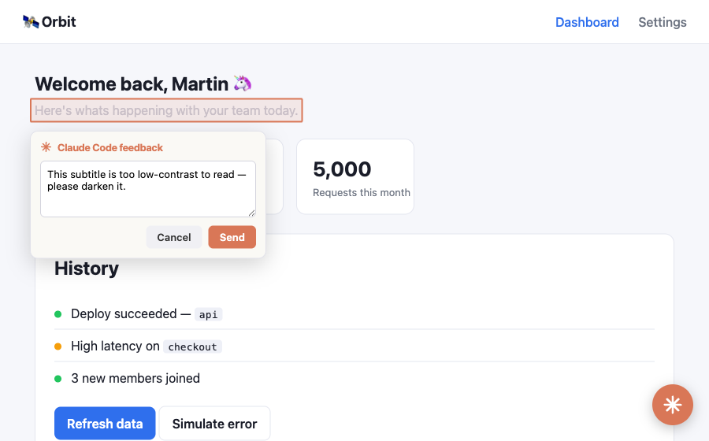

# claude-code-feedback

**Stop pasting screenshots into Claude Code. Point at the problem in your browser instead.**

Reviewing a frontend with Claude usually means screenshotting the page, cropping it, pasting it into the chat, and typing out *"the button in the top-right is misaligned."* `claude-code-feedback` turns all of that into a single gesture: draw a box on your running app, type a note, and hit send. Claude gets the screenshot, the exact element you marked, the page URL, and any recent console errors — then fixes it, right in your session.



Ever wished you could give Claude feedback on a frontend as easily as leaving a comment? That's the whole idea — review your live app like a design doc, with Claude Code as the reviewer who actually does the work.

## How it works

```
 ┌─────────────────────────────┐  POST /feedback   ┌─────────────────────────┐  channel push   ┌──────────────┐
 │ widget on your dev site     │ ────────────────▶ │ bridge (local process)  │ ──────────────▶ │ Claude Code  │
 │ screenshot + selector +     │  message, region, │ • HTTP intake :7878     │  (or MCP tools) │ session      │
 │ console/network diagnostics │  screenshot, diag │ • MCP stdio + channel   │                 │              │
 └─────────────────────────────┘                   └─────────────────────────┘                 └──────────────┘
```

A small in-page **widget** captures your feedback and posts it to a local **bridge**. The bridge is a single Node process that also plugs into Claude Code, handing each item to your session — screenshot and all. The widget is framework-agnostic (vanilla TypeScript with `html2canvas` and `@medv/finder`), so it drops onto any dev site without a build step or dependency of yours.

## Get started

The experience this is built for is **live mode**: feedback streams straight into your session the moment you send it — no polling, no "check my feedback" prompt. It's powered by Claude Code [channels](https://code.claude.com/docs/en/channels).

**1. Install the plugin.** In any Claude Code session:

```
/plugin marketplace add Morton/claude-code-feedback
/plugin install web-feedback@claude-code-feedback
```

**2. Launch Claude Code in live mode** from your project:

```bash
claude --dangerously-load-development-channels plugin:web-feedback@claude-code-feedback
```

Channels are a research preview, so custom ones need the development flag for now. Add `--dangerously-skip-permissions` if you want Claude to apply changes fully hands-off — in projects you trust.

**3. Add the widget to your app.** Drag this bookmarklet to your bookmarks bar, then click it on any `localhost` page. Nothing to install in your project:

```
javascript:(()=>{const s=document.createElement('script');s.src='http://localhost:7878/widget.js';document.body.appendChild(s);})()
```

**4. Leave feedback.** Click the button, draw a box around what's wrong, type a note, and send. It lands in your session immediately and Claude gets to work — reading the screenshot, locating the code, and making the change.

Keep the session open and comment as you browse. Every note arrives live.

> Live mode requires Claude Code **v2.1.80+** and Anthropic authentication (claude.ai or a Console API key; it isn't available on Amazon Bedrock, Google Vertex, or Microsoft Foundry). On Team and Enterprise plans, an admin must enable channels first.

## Prefer to stay in the driver's seat?

If you'd rather trigger Claude yourself, skip the `--channels` flag and use the bundled skill. Leave your comments, then run:

```
/web-feedback:feedback
```

Claude reviews everything pending, applies each change, and marks it resolved. To keep applying comments as they arrive, run it under `/loop`. This pull mode works with a plain plugin install — no special launch flags needed.

## What Claude receives

Every comment carries the context Claude needs to act without guessing:

- an annotated **screenshot** of the region you marked,
- the **CSS selector** and tag of the element,
- the **page URL**, and
- recent **console and network errors** from the page.

The bridge exposes this through four MCP tools:

| Tool | Purpose |
|---|---|
| `list_feedback` | List pending items with message, URL, selector, and diagnostics |
| `get_feedback(id)` | Fetch one item in full; returns the screenshot as an image |
| `resolve_feedback(id)` | Mark an item handled so it drops off the list |
| `clear_feedback` | Discard everything |

## Requirements

- **[Claude Code](https://docs.claude.com/en/docs/claude-code/overview)** — live mode needs v2.1.80 or later; the plugin install needs a version with `/plugin` support
- **Node.js 18** or later
- **[pnpm](https://pnpm.io/)** — only if you build from source

## Run it from source

Prefer to run the bridge straight from this repo instead of installing the plugin? Build it, then register it as an MCP server.

```bash
pnpm install
pnpm run build   # builds public/widget.js and dist/bridge.js
```

Add the bridge to your project's `.mcp.json`:

```json
{
  "mcpServers": {
    "web-feedback": {
      "command": "node",
      "args": ["/absolute/path/to/claude-code-feedback/dist/bridge.js"]
    }
  }
}
```

Claude Code launches it on demand, and it serves the widget on `http://localhost:7878`. Set `CLAUDE_FEEDBACK_PORT` to change the port. This path is machine-specific, so keep your `.mcp.json` local (it's gitignored here).

Inject the widget with the bookmarklet above, or add a dev-only tag to your app:

```html
<script src="http://localhost:7878/widget.js"></script>
```

For live mode from source, launch with `claude --dangerously-load-development-channels server:web-feedback` — the name matches the key in your `.mcp.json`.

## Try it with the example app

The repo ships a small demo dashboard, "Orbit," with a few deliberate UI problems to practice on:

```bash
pnpm run example   # serves the demo at http://localhost:3000
```

It loads the widget cross-origin from the bridge, exactly like a real dev site would. See [`example/`](example/) for the details, and [`plugin/`](plugin/) for how the plugin is packaged.

## Good to know

- The feedback queue lives **in memory** in the bridge process. Run one Claude Code session per project on a given port — a second session can't bind `:7878` and won't receive feedback (it stays connected but logs a warning). Use `CLAUDE_FEEDBACK_PORT` to run more than one.
- Start the bridge (by launching Claude Code) **before** the widget loads, or `widget.js` returns a 404.

## Security

Feedback becomes text and images in your Claude Code session, so the intake is a potential prompt-injection surface. The bridge is locked down accordingly:

- It **binds to `127.0.0.1` only** — nothing on your network can reach it.
- `POST /feedback` is **rejected unless the browser `Origin` is a loopback host**, so a random website you visit can't push feedback into your session.
- Set **`CLAUDE_FEEDBACK_TOKEN`** for an extra layer: the bridge then requires that shared secret on every post and injects it into the widget automatically, so nothing else on the machine can post.

## Roadmap

The end-to-end loop is proven and packaged as a Claude Code plugin. On the horizon:

- A **browser extension** that injects the widget on any `localhost` site automatically, replacing the bookmarklet.
- **Element-to-source mapping** — capture the source `file:line` of the marked element (via React JSX source or a Vite plugin) so Claude jumps straight to the component.
- **On-disk persistence** for the queue and screenshots (currently in memory, per bridge process).
- Getting the channel onto the official allowlist so live mode no longer needs the development flag.

## Contributing

Issues and pull requests are welcome — it's a small, hackable codebase built from three files: `src/widget/widget.ts` (the in-page widget), `src/bridge.ts` (HTTP intake, MCP server, and channel), and `src/store.ts` (the queue).

```bash
pnpm install
pnpm run build          # public/widget.js and dist/bridge.js
node test/loop.mjs      # smoke-test the MCP loop
pnpm run build:plugin   # regenerate the bundled plugin artifacts before committing
```

## License

[MIT](LICENSE) © Martin Heller
